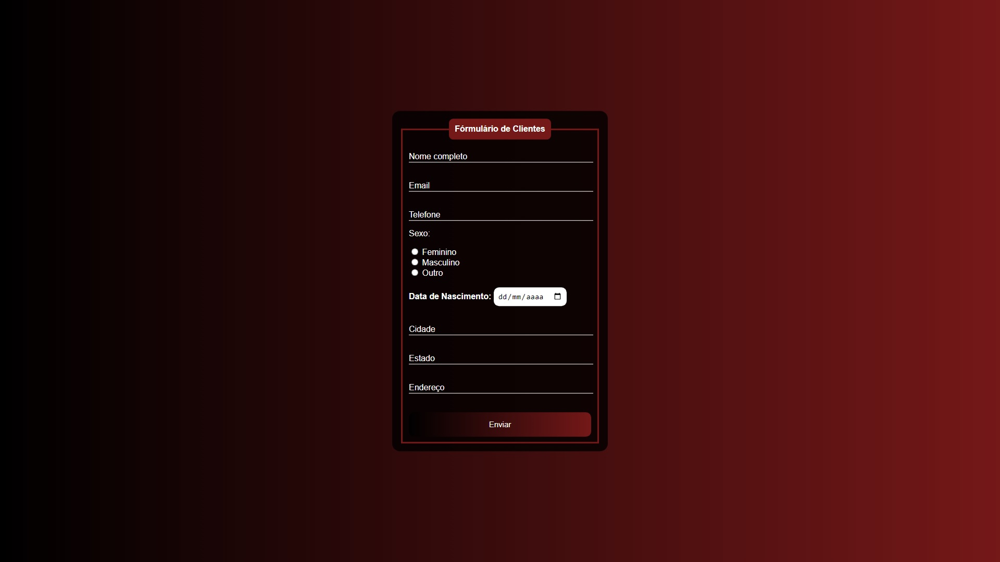

<h1 align="center"> Formulario PHP </h1>

  <a href="#-tecnologias">Tecnologias</a>&nbsp;&nbsp;&nbsp;|&nbsp;&nbsp;&nbsp;
  <a href="#-projeto">Projeto</a>&nbsp;&nbsp;

  

 

  

## 🚀 Tecnologias

Esse projeto foi desenvolvido com as seguintes tecnologias:

- HTML e CSS
- PHP
- Git e Github

## 💻 Projeto

O formulário é apenas um treino efetuado para a linguagem de progração PHP.
